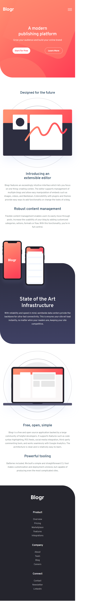

# Frontend Mentor - Blogr landing page solution

This is a solution to the [Blogr landing page challenge on Frontend Mentor](https://www.frontendmentor.io/challenges/blogr-landing-page-EX2RLAApP). Frontend Mentor challenges help you improve your coding skills by building realistic projects. 

## Table of contents

- [Overview](#overview)
  - [The challenge](#the-challenge)
  - [Screenshot](#screenshot)
- [My process](#my-process)
  - [Built with](#built-with)
- [Author](#author)

## Overview

### The challenge

Users should be able to:

- View the optimal layout for the site depending on their device's screen size
- See hover states for all interactive elements on the page

### Links

## What I Learned
SASS is the highlight of my learning while working through this project. This is somthing I have never worked on before and had no pior knoledge how to go about it. i had to do a litte reseach on youtube and Stackover flow. At end, i was able to complete the project with SASS.

### Screenshot

### Built with

- HTML5
- SASS
- Flexbox
- Destop-first workflow then Mobile
- JS for mobile navigation toggle

### Continued Development
While working through this project, I noticed I still needed to perfect SASS. I believe I can make a smoother transition for the mobile navigation toggle. So, I'll be working on that for the next couple of days.

## Author

- Joshua Abraham
- Frontend Mentor - [link](https://www.frontendmentor.io/profile/joshua943)